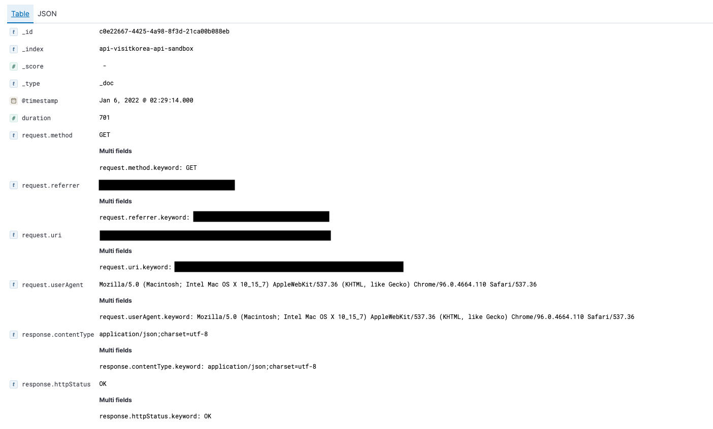
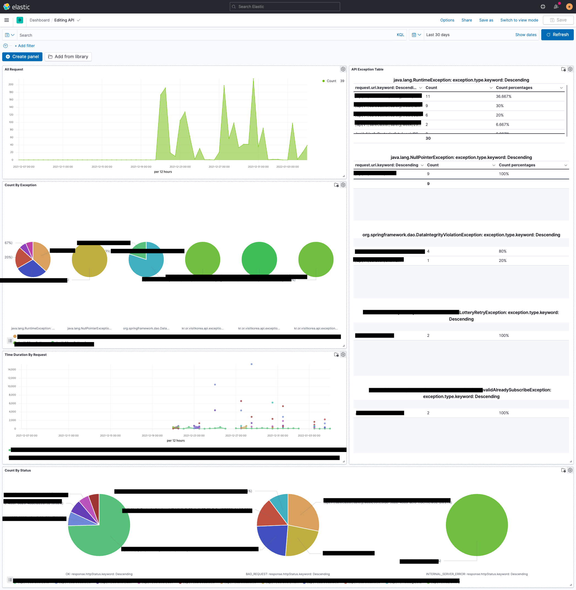

# Service Watcher

## Introduction

---

Spring Boot 기반의 Application에서 발생하는 API 요청 및 응답에 대한 모니터링 환경을 손쉽게 구성하도록 합니다.

HTTP/REST API 응답이 이루어질 때 요청/응답 Payload 에서 의미있는 항목들을 하나의 Metric 데이터로 하여금 다양한 클라이언트에 전송됩니다.

### 클라이언트

- Elasticsearch - 지원
- ~~Kafka - 아직 미지원~~
- ~~Logstash - 아직 미지원~~
- ~~JSON - 아직 미지원~~
- ~~CSV - 아직 미지원~~

> Elasticsearch, Kafka, Logstash 등의 인프라 구축은 되어있어야 합니다.

## Usage

---

### Dependency

---
##### Maven
- pom.xml
```xml
<project>
    <repositories>
        <repository>
            <id>github-repository-service-watcher</id>
            <url>https://maven.pkg.github.com/youspend8/service-watcher</url>
        </repository>
    </repositories>

    <dependencies>
        <dependency>
            <groupId>io.assist</groupId>
            <artifactId>service-watcher</artifactId>
            <version>0.2.7</version>
        </dependency>
    </dependencies>
</project>
```

##### Gradle
- build.gradle

```groovy
repositories {
    maven {
        url "https://maven.pkg.github.com/youspend8/service-watcher"
        name "github-repository-service-watcher"
    }
}

dependencies {
    implementation 'io.assist:service-watcher:0.2.7'
}
```

### Property Configuration

- application.yml

```yaml
service:
  watcher:
    service-name: watcher-dev
    produce-mode: es
    es:
      host: ${ES_HOST}
      port: ${ES_PORT}
      username: ${ES_USERNAME}
      password: ${ES_PASSWORD}
      forward-proxy:
        - host: ${SERVER_IP_ADDRESS}
          destination: ${DESTINATION_IP_PORT}
```
- Property

|Name|Type|Required|Value|Description|
|------|---|---|---|---|
|service.watcher.service-name|String|X|-|서비스 명 (기본값 : Spring Application Name)|
|service.watcher.produce-mode|String|O|es, kafka, logstash, csv, json|Produce 모드|
|service.watcher.es|Object|O|-|produce-mode가 es 일시 필수|
|service.watcher.es.host|String|O|xxx.xxx.xxx.xxx|Elasticsearch 서버 IP|
|service.watcher.es.port|Integer|O|9200|Elasticsearch 서버 Port|
|service.watcher.es.username|String|O|elastic|Elasticsearch 서버 인증 Username (X-PACK)|
|service.watcher.es.password|String|O|changeme|Elasticsearch 서버 인증 Password (X-PACK)|
|service.watcher.es.forward-proxy|Array|X|-|포워드 프록시 사용 여부로 분산 어플리케이션 환경의 경우 다수의 서버와 다수의 프록시 서버가 존재할 수 있는 환경에서 유용함|
|service.watcher.es.forward-proxy.host|String|O|xxx.xxx.xxx.xxx|해당 어플리케이션이 실행되는 서버의 IP 주소|
|service.watcher.es.forward-proxy.destination|String|O|xxx.xxx.xxx.xxx:xxxx|Forward Proxy 대상 서버 IP 및 포트|

### Application EntryPoint에 @EnableServiceWatcher 애노테이션 추가

- `@EnableServiceWatcher`
```java
@SpringBootApplication
@EnableServiceWatcher
public class DemoApplication {
    public static void main(String[] args) {
        SpringApplication.run(DemoApplication.class, args);
    }
}
```

### Controller 클래스에 @ApiWatch 애노테이션 추가
- `@ApiWatch`
```java
@RestController
@ApiWatch
public class AnyController {
    ...
}
```

> 기본적으로 Controller 클래스에 `@ApiWatch` 애노테이션을 달아주면 해당 클래스내 요청을 처리하는 모든 Mapping 메소드에서 발생하는 요청의 메트릭이 전송 및 수집됩니다. 만일에 특정한 메소드에서는 메트릭 수집을 원하지 않는다면 해당 메소드에 `@ApiSkip`  애노테이션을 달아줌으로 처리할 수 있습니다.
> 아래는 해당 내용의 사용 예시입니다.

- `@ApiSkip`
```java
@RestController
@ApiWatch
public class AnyController {
    @GetMapping
    @ApiSkip
    public void index() {
        ...
    }
}
```

### Test

기본적으로는 메트릭 전송 및 수집이 성공적으로 이루어졌을 시 다음과 같이 콘솔상에서 INFO Level의 Log Message가 발생합니다.
```text
2022-01-05 17:29:14.789  INFO 43049 --- [nio-8080-exec-8] i.a.s.d.ServiceWatcherEventDispatcher    : ServiceWatcher Event Dispatching --> ApiEvent(duration=701, request=ApiEventRequest(method=GET, uri=/v1/safeCaster/detail, contentType=null, userAgent=Mozilla/5.0 (Macintosh; Intel Mac OS X 10_15_7) AppleWebKit/537.36 (KHTML, like Gecko) Chrome/96.0.4664.110 Safari/537.36, referrer=http://xxxxxx.xxxx/xxxx.xxx), response=ApiEventResponse(contentType=application/json;charset=utf-8, bytes=null, httpStatus=200 OK), exception=null, timestamp=2022-01-05T17:29:14.788955)
```

Elasticsearch의 경우 실제 저장되는 데이터의 형태는 아래의 모습과 같습니다.



이러한 Metric 데이터를 통해 Elasticsearch 의 경우 다음과 같은 Visualize Dashboard를 만들 수 있습니다.

